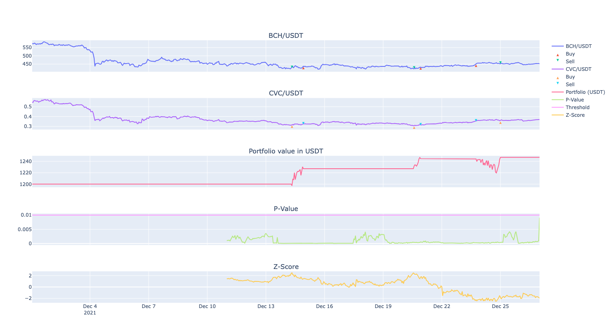

[](https://github.com/gbeced/basana/actions/workflows/runtests.yml)
[](https://badge.fury.io/py/basana)
[](https://basana.readthedocs.io/en/latest/)
[](https://opensource.org/licenses/Apache-2.0)
[](https://pepy.tech/project/basana)

# Basana

**Basana** is a Python **async and event driven** framework for **algorithmic trading**, with a focus on **crypto currencies**.

## Key Features

* Backtesting exchange so you can try your trading strategies before using real funds.
* Live trading at [Binance](https://www.binance.com/) and [Bitstamp](https://www.bitstamp.net/) crypto currency exchanges.
* Asynchronous I/O and event driven.

## Getting Started

### Installation

The examples use [TALIpp](https://github.com/nardew/talipp) for the technical indicators, pandas and statsmodels.

```
$ pip install basana[charts] talipp pandas statsmodels
```

### Backtest a pairs trading strategy

#### Download historical data for backtesting

```
$ python -m basana.external.binance.tools.download_bars -c BCH/USDT -p 1h -s 2021-12-01 -e 2021-12-26 -o binance_bchusdt_hourly.csv
$ python -m basana.external.binance.tools.download_bars -c CVC/USDT -p 1h -s 2021-12-01 -e 2021-12-26 -o binance_cvcusdt_hourly.csv
```

#### Run the backtest

```
$ python -m samples.backtest_pairs_trading
```



The Basana repository comes with a number of [examples](./samples) you can experiment with or use as a template for your own projects:

**Note that these examples are provided for educational purposes only. Use at your own risk.**

## Documentation

[https://basana.readthedocs.io/en/latest/](https://basana.readthedocs.io/en/latest/)

## Help

You can seek help with using Basana in the discussion area on [GitHub](https://github.com/gbeced/basana/discussions).
